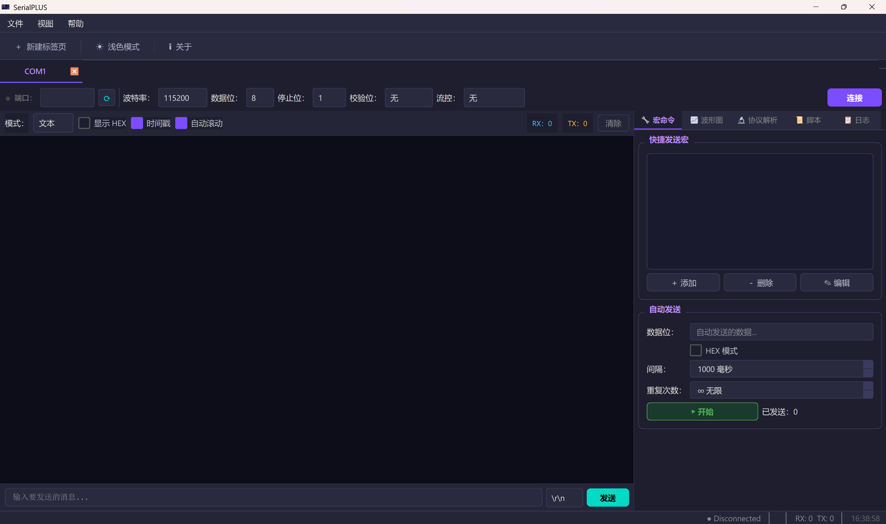

# SerialPLUS

**基于 Qt6 的全功能串口终端 · C++ 构建**

---

## 界面预览



---

## 功能特性

### 串口连接
- 支持 Windows 所有可用 COM 口，一键刷新端口列表
- 波特率 110 ~ 921600 全范围覆盖
- 数据位（5/6/7/8）、停止位（1/1.5/2）、校验位（None/Odd/Even/Mark/Space）
- 硬件/软件流控可选
- 连接状态实时指示，RX/TX 字节数统计

### 终端收发
- 文本 / HEX 双模式显示，可随时切换
- 发送支持 HEX 格式（自动校验字节间隔）
- 时间戳开关，记录每一帧到达时间
- 接收区自动滚动，新数据始终可见
- 可手动清除接收区

### 多标签页
- `Ctrl+T` 新建标签页，`Ctrl+W` 关闭当前标签
- 每个标签页独立串口连接，支持多串口并发操作
- 关闭最后一个标签时自动新建，永不空窗
- 标签显示端口号 + 连接状态，一目了然

### 宏命令（快捷发送）
- 预设常用指令，双击即发，无需手动输入
- 支持 HEX / 文本两种格式
- 宏列表可视化编辑，支持增删改

### 自动发送
- 定时循环发送，适合老化测试、压力测试场景
- 发送间隔最小 10ms，最大无限制
- 可设定发送次数（0 = 无限循环）

### 实时波形（数据可视化）
- 接收区数据为数字时，自动绘图
- 支持 1 ~ 8 通道同时显示
- 分隔符支持：逗号 `,`、空格 ` `、Tab `\t`
- 可设置采样窗口大小，波形实时滚动
- 鼠标悬停显示数值，精确读数

数据格式示例：
```
# 单通道
123.5
124.1
125.0

# 多通道（逗号分隔）
1.2,3.4,5.6
1.3,3.5,5.7
```

### 协议解析
- Modbus RTU 帧自动解析（功能码、寄存器地址、数据域）
- 自定义帧格式支持，帧构建器可视化拼接
- 解析结果高亮显示，易于调试

### 脚本支持
- 支持 Python / Lua 脚本执行
- 可在脚本中调用串口收发，实现自动化测试流程
- 外部进程调用，扩展无限可能

### 数据记录（日志）
- 带时间戳的接收数据记录，保存为 `.log` 文件
- 支持 HEX 格式记录，方便协议分析
- 开始/停止记录一键切换

### 主题切换
- Material Dark / Light 双主题
- 一键切换，全局生效
- 图标、配色完全适配，护眼/明亮两相宜

---

## 快速开始

1. 双击 `dist\SerialPLUS.exe` 启动
2. 在侧边栏选择端口和波特率，点击「连接」
3. 在终端输入区输入内容，`Enter` 发送
4. `Ctrl+T` 新建标签页，同时操作多个串口

---

## 项目结构

```
SerialPLUS/
├── src/
│   ├── core/          # 串口管理 / 日志引擎 / 宏管理 / 自动发送 / 脚本引擎
│   ├── protocol/      # Modbus RTU 解析 / 自定义帧构建器
│   └── ui/
│       ├── widgets/   # Material 风格控件（Button / Card / HexEditor / StatusBar）
│       ├── MainWindow.*       # 主窗口
│       ├── SerialTab.*        # 标签页容器
│       ├── TerminalWidget.*   # 终端收发面板
│       ├── PortConfigWidget.* # 串口配置面板
│       ├── MacroPanel.*       # 宏命令面板
│       ├── PlotWidget.*       # 实时波形面板
│       ├── ProtocolPanel.*   # 协议解析面板
│       ├── ScriptPanel.*      # 脚本执行面板
│       ├── LogPanel.*         # 数据记录面板
│       └── ThemeManager.*     # 主题管理
├── resources/         # 图标、样式表等资源
├── dist/              # 绿色发布包（含 Qt6 DLL，解压即用）
├── build.bat          # MinGW 一键构建脚本
├── build_msvc.bat     # MSVC 一键构建脚本
└── CMakeLists.txt
```

---

## 许可证

MIT License — 自由使用、修改、分发。
